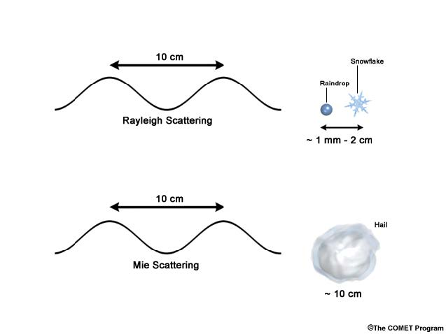
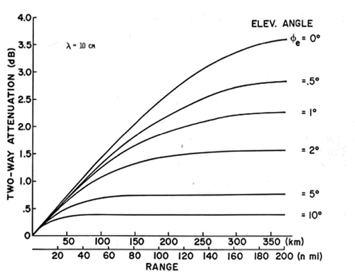
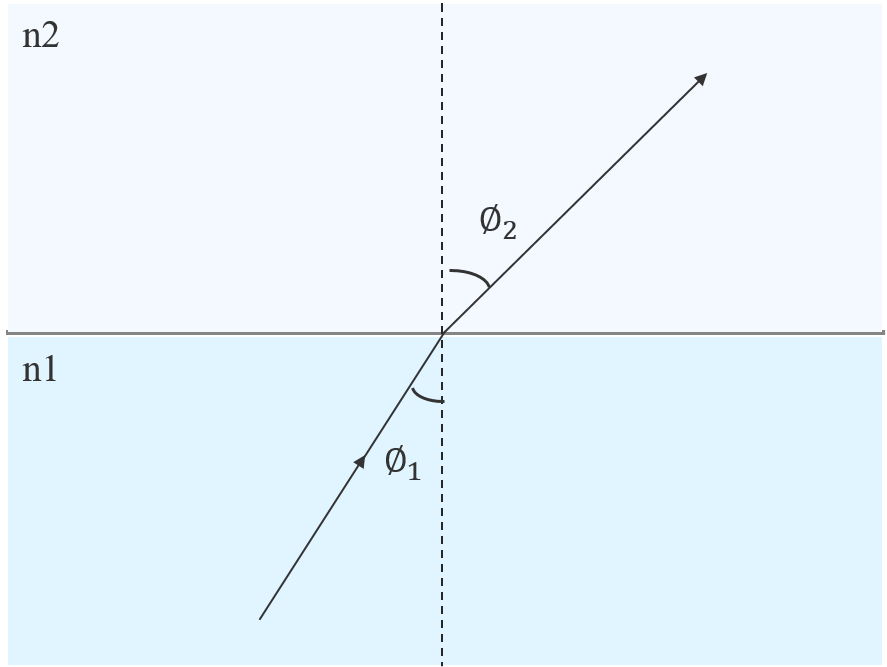
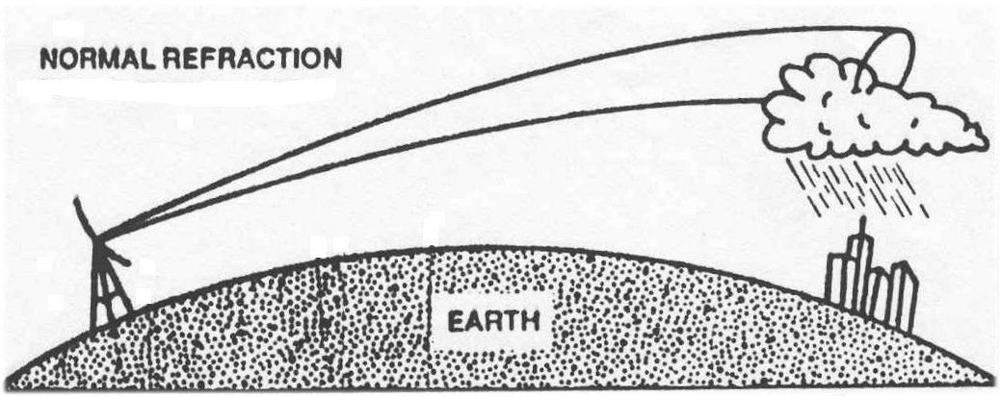
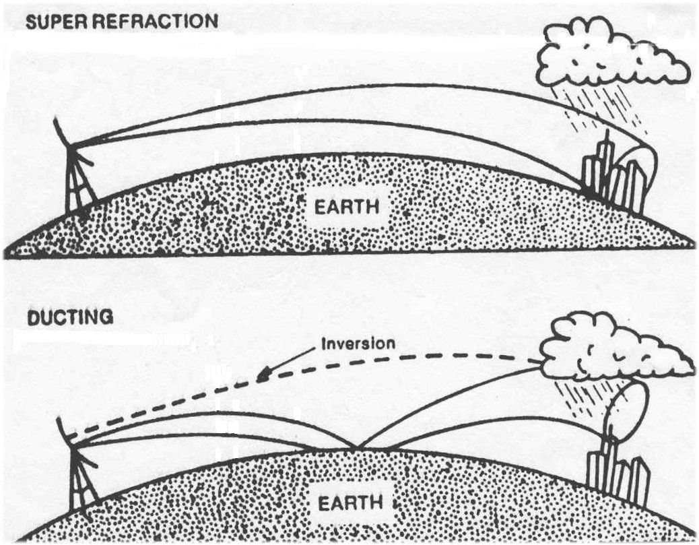
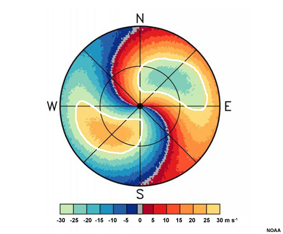

多普勒天气雷达原理
=============================

**雷达** ，英文名为 *Radar* ，是 *radio detecting and ranging of objects* 的缩写，意即对反射性物体的无线电检测和定位，其本质为一通过发射和接收电磁波来探测和定位目标物的遥感系统。其工作流程为：发射 -> 截获 -> 散射 -> 天线接收 -> 信号处理获取信息。

.. note::
	**散射和反射的区别**

	两者相同点为：改变入射电磁波的方向，但能量形式不变；散射是在入射波的极化下做强迫多级振荡，发出次波。

我国天气雷达发展概况
	1. 1950年：引进Decca41雷达用于监测天气。
	2. 1960S：研制X波段小型天气雷达(711)，改造S波段军用雷达用于警戒台风 
	3. 1970S：研制C波段天气雷达(713)和S波段天气雷达(714)，作为国内主要布网天气雷达 
	4. 1980S：完成以C波段天气雷达为主，沿海S波段天气雷达的业务天气雷达站网，711雷达用作局地使用和人工影响天气试验。开始对部分天气雷达进行数字化改造 
	5. 1990S：前期进行多普勒天气雷达技术试验，中期着手发展新一代天气雷达系统，后期开始布站用于气象业务 
	6. 2000S：中期完成新一代天雷达站网建设 
	   

中国新一代天气雷达网
-----------------------

我国新一代天气雷达业务组网的建设目标是：在我国东部和中部地区，装备先进的新一代S频段和C频段多普勒天气雷达系统，组成探测空间相互衔接覆盖的监测网，实时监测提供降水强度、平均径向速度和频谱宽度等信息。对降水，特别是暴雨、热带气旋、强对流等灾害性天气和重要天气系统进行有效的监测和警报。

.. note::
	国际电信联盟(ITU)为无线电定位(雷达)指定了特定的频段。最初的代码(如P，L，S，X和K)是在二战期间为保密而引入的

中国新一代天气雷达网布网思路：

#. 中东部：暴雨、台风多，选择S波段
#. 西部：降雨少，选择C波段
#. 云南：多山，选择C波段
#. 东北：降雨季节短，冬季降雪，选择C波段
   
中国新一代天气雷达网的雷达型号：

+-----------+------------+------------+------------+
| S波段     | 生产厂家   | C波段      | 生产厂家   |
+===========+============+============+============+
| CINRAD/SA | 北京敏视达 | CINRAD/CA  |            |
+-----------+------------+------------+------------+
| CINRAD/SB | 北京敏视达 | CINRAD/CB  | 北京敏视达 |
+-----------+------------+------------+------------+
| CINRAD/SC | 成都784厂  | CINRAD/CC  | 合肥38所   |
+-----------+------------+------------+------------+
|           |            | CINRAD/CD  | 成都784厂  |
+-----------+------------+------------+------------+
|           |            | CINRAD/CCJ | 合肥38所   |
+-----------+------------+------------+------------+
		
雷达的优势有：资料密集，分辨率高，立体扫描，产品丰富。主要的应用包括，对灾害性天气的监测和预警，定量估测大范围降水，风场信息，改善高分辨率数值天气预报模式的初始场。

新一代天气雷达系统的主要构成
-----------------------------------------
新一代天气雷达系统的主要构成包括，雷达数据采集子系统（RDA）、雷达产品生成子系统（RPG）、主用户终端子系统（PUP）、连接线路及附属设备四个部分。

雷达数据采集子系统（RDA）
^^^^^^^^^^^^^^^^^^^^^^^^^^^^^^^^^^
雷达数据采集子系统（RDA）主要结构为天线、发射机、接收机、信号处理。
发射机发射射频信号，功率达750KW；
信号处理器(硬件信号处理器（与接收机接口交换数据，对数据预处理，接收并处理来自A/D变换器的数据，送往可编程信号处理器）和可编程信号处理器）：完成三个任务：A/D转换，地物去杂波、距离去折叠；
监控计算机：监控和标定RDA硬件、形成RDA基数据和信息头数据（时间、仰角、标定参数等）、管理宽带通讯、控制RDA和控制信号处理等。

扫描方式（scan strategy）
+++++++++++++++++++++++++++++++
扫描方式规定了雷达在一次体积扫描（volume scan）中使用多少仰角和时间。
WSR-88D 和 CINRAD WSR-98D 使用三种扫描方式：

#. 5分钟完成14个不同仰角上的扫描（14/5）
#. 6分钟完成9个不同仰角上的扫描（9/6）
#. 10分钟完成5个不同仰角上的扫描（5/10）

体扫模式(VCP，Volume Cover Pattern）
+++++++++++++++++++++++++++++++++++++++++++
扫描方式确定了一次体积扫中使用多少个仰角，而体扫模式则规定了在雷达的圆锥扫描过程中使用哪些仰角进行扫描。

CINRAD-SA雷达可有20个不同的VCP，目前只定义了其中的4个，分别为VCP11、VCP21、VCP31、VCP32（未定义）。

#TODO: VCP11、VCP21、VCP31速览

工作模式（Operational Mode）
+++++++++++++++++++++++++++++++++
雷达的工作模式决定了使用的VCP扫描模式，一般工作模式有降水模式和晴空模式。

工作模式A：降水模式使用VCP11或VCP21，相应的扫描方式分别为14/5（5分钟完成14个仰角体扫）和9/6（6分钟完成9个仰角体扫）。

工作模式B：晴空模式使用VCP31或VCP32，两者都使用扫描方式5/10（10分钟完成5个仰角体扫）。

雷达产品生成系统（RPG）
^^^^^^^^^^^^^^^^^^^^^^^^^^^^^^^
雷达产品生成系统RPG，从雷达数据采集子系统RDA接收数字化的基本数据，对其进行处理和生成各种产品，是控制整个雷达系统的指令中心。其生成的产品包括基本产品：强度、速度和谱宽，和导出产品：由基数据经过特定的算法得到的（33种）。

RPG的操作界面为雷达控制台（UCP），其对RDA、RPG和宽带通讯直接控制，具有应用终端（发布命令和修正参数）和系统控制台（操作员与RPG的OS的交互来达到文件维护、文件和数据的备份以及软件安装等）的双重功能。

主用户终端子系统（PUP）
^^^^^^^^^^^^^^^^^^^^^^^^^^^^^
主用户终端子系统PUP的主要功能是获取、存储和显示产品、状态监视和产品编辑注释。一部雷达可以配多台PUP，产品的获取是通过PUP向RPG发出请求的方式完成。常规、一次性请求、产品－预警配对。

气象目标对雷达电磁波的散射
---------------------------------
电磁辐射包括太阳辐射、热辐射、无线电波等，它的波长范围很广，从 10^{-10} 微米（宇宙射线）到 10^{10} 微米（无线电波）。天气雷达所使用的电磁波位于微波波段1mm-30cm波长范围内，主要波长为10cm（S波段）， 5cm（C波段），3cm（X波段）。

气象目标对雷达电磁波的散射是雷达探测大气的基础。散射是全方位的，散射是不均匀的。

大气中引起雷达波散射的主要物质：大气介质（大气气体分子的散射，大气介质折射指数分布不均匀引起的散射与反射）；云和降水粒子（因相态、几何形状而不同）。降水粒子包括：雨滴、雪花、冰雹等，对天气雷达发射的电磁波起显著散射作用的是云和降水粒子。

散射的分类
^^^^^^^^^^^^^^^^^
当雷达发射的电磁波波长 :math:`\lambda` 一定时，粒子的散射情况主要取决于粒子直径 d 与波长  :math:`\lambda` 之比。

瑞利散射： :math:`d << \lambda` 或 :math:`\alpha = \frac{2 \pi a}{\lambda} < 0.13` 时的小球形粒子的散射

米（Mie）散射： :math:`d \approx \lambda` 或 :math:`\alpha  = \frac{2 \pi a}{\lambda} \geq 0.13` 时的小球形粒子的散射。

雷达截面
^^^^^^^^^^^^^^^^^
能流密度：垂直于入射能单位横截面积上的能量，随着距离的增大，其能流密度迅速减小。

.. math::
	S_s = \frac{S_i}{R^2} \beta(\theta, \phi)

后向散射截面
++++++++++++++++++++++
后向散射截面：设有一理想散射体，其截面为 :math:`\sigma` ，它能全部接受到其上的电磁波能量，并全部均匀地向四周散射，
若该理想散射体返回雷达天线处的电磁波能流密度，恰好等于同距离上实际散射体返回雷达天线的电磁波能流密度，
则该理想散射体的截面 :math:`\sigma` 称为实际散射体的后向散射截面。

入射能流密度 :math:`s_i` 乘上雷达界面 :math:`\sigma` 得到的是这个散射粒子的总散射功率 :math:`P_s` ，即

.. math::
	P_s = s_i \sigma = s_i 4 \pi \beta(\pi)

当散射粒子以这个总散射功率 :math:`P_s` 向空间做各项同行散射时，散射到天线处的后向散射能流密度 :math:`S_s(\pi)` 正好与其在天线处造成的实际后向散射能流密度的大小一致。

后向散射截面是一个虚拟的面积，用来定量表示粒子后向散射能力的强弱，在入射能流密度一定时，后向散射界面越大，粒子的后向散射能力越强，在相同条件下，产生的回波信号也越强。

对于普通球形粒子，在瑞利散射条件下，其雷达界面为，

.. math::
	\sigma = \frac{64 \pi^5 r^6}{\lambda^4} | \frac{m^2 - 1}{m^2 + 2} | = \frac{\pi^5 D^6}{\lambda^4} | \frac{m^2 - 1}{m^2 + 2} |

粒子的散射能力与粒子的大小，形状、电学特性有关，目前能对其散射做出精确解析解的只有少数几何形状比较特殊的粒子，如：圆球形，圆柱形，椭球形。
气象上的云滴、雨滴等粒子一般近似地认为圆球形或椭球形。小水球的|K|2值为0.93左右，小冰球的|K|2值为0.197，所以小冰球的后向散射截面大约只有同样大小的小水球的1/5。

大气中滴谱半径，云滴为5~10μm，不超过50μm；雨滴为0.25~1.5mm，以0.35~0.45mm最多，强对流性降水的雨滴有大于2mm的。但当其大于3mm时就会破裂。D的最大取值约为0.04λ 。

+-------------------------+--------------------------------------------------------------------------------------------+
| :math:`\lambda = 10cm`  | 雨滴:0.01-0.5cm（所有的雨滴）、雪花：0.01-3cm（大部分雪花）、冰雹：0.5-2.0cm（小到中等雹） |
+-------------------------+--------------------------------------------------------------------------------------------+
| :math:`\lambda = 5cm`   | 雨滴:0.01-0.5cm（所有的雨滴）、雪花：0.01-1cm（小雪花）、冰雹：0.5-0.75cm（小雹）          |
+-------------------------+--------------------------------------------------------------------------------------------+
| :math:`\lambda = 3cm`   | 雨滴:0.01-0.5cm（所有的雨滴）、冰晶：0.01-0.5cm（单冰晶）、软雹：0.1-0.5cm（软雹）         |
+-------------------------+--------------------------------------------------------------------------------------------+
| :math:`\lambda = 0.8cm` | 雨滴:0.01-0.15cm（云和毛毛雨）、冰晶：0.01-0.15cm（单冰晶）                                |
+-------------------------+--------------------------------------------------------------------------------------------+

.. note::
	是否雷达波长 λ 越短，雷达的探测能力就越强？

不同粒子散射能力对比
+++++++++++++++++++++++++

**冰水混合球** ：多孔海绵状冰雹，雪花、雪团下降融化及冰球融化的后期。

**水包冰球** ：冰粒表面融化、冰雹与过冷水滴碰并来不及冻结。

1. 散射能力随D的增加而增大；
2. 图形比对可以看出，在D较小时，水球的散射能力约冰球的5－6倍，在D较大时（60~80）两者差不多，但D>80mm，水球的散射能力比冰球小(只有0.04~0.2倍）；
3. 外包水膜的散射介于冰晶和水之间。

衰减
---------------------------
衰减指电磁波能量沿传播路径减弱的现象，造成衰减的原因是电磁波传播路径上气体分子和粒子（云、雨、冰雹）的散射和吸收转变化为热能或其他形式的能量。

定义 **衰减系数** 表示介质对电磁波衰减能力的强弱，符号为 k ，其等于通过单位距离后电磁波能流密度减少的分贝数。

.. math::
	k = -10lg\frac{P}{P_0}

上式中的 :math:`P_0` 表示没有衰减时的电磁波能流密度，P为通过单位距离后电磁波的能流密度。

当电磁波传播到距离 r 处，并被粒子散射回雷达处，此过程中介质衰减引起的回波功率减少的分贝数为，

.. math::
	10lg\frac{\bar{P_r}}{\bar{P_{r0}}} = -2 \int_0^r k dr

上式中的 :math:`\bar{P_{r0}}` 和 :math:`\bar{P_{r}}` 分别表示没有介质衰减和有介质衰减时的回波功率，上式可变形为，

.. math::
	\bar{P_r} = \bar{P_{r0}} \cdot 10^{-2 \int_0^r k dr}

1. 衰减由大气中的云、雨、雪、冰雹、水汽和其他气体对雷达电磁波的散射和吸收所导致
2. 在强降水情况下，C波段雷达的衰减可能是严重的，从而影响降水估计
3. 雨造成的衰减比云要强的多，冰雹造成的衰减最强
4. 现代天气雷达可以通过算法来识别和订正衰减

气体的衰减
^^^^^^^^^^^^^^^^^^^^^^
气体对电磁波的衰减主要为水汽在1.35±0.18cm和0.2cm波长的吸收带以及氧气在0.5cm波长的吸收带，
对于发射厘米波的天气雷达而言，气体衰减对厘米波影响小，量级约为 :math:`10^{－3} ~ 10^{－4} dB/km`

	图 大气气体对10cm雷达波的衰减

云的衰减
^^^^^^^^^^^^^^^^^^^^^^
云滴为半径小于100μm的水滴或冰晶，云造成的衰减主要是由于吸收作用引起。

云衰减的特性 :
	#. 液态云温度降低，云衰减增大
	#. 冰云的衰减远小于同样含水量的水云的衰减（小2个量级）
	#. 随波长的增加，云衰减迅速减小，波长由3变到10cm时，衰减减小一个量级
	#. 对波长5、10 厘米波段，云造成的衰减总衰减量很小，通常可以忽略

雨的衰减
^^^^^^^^^^^^^^^^^^^^^^
实际应用中，把雨的衰减表示成降水率（雨强）的函数，雨的衰减系数与雨强近于成正相关关系，
同时雨的衰减系数与雷达波长有关，波长越短，衰减越大，随着波长的增加，雨对雷达波的衰减迅速减小。

.. figure:: _static/雨的衰减系数.png
	:align: center
	:scale: 80%
	:alt: 雨的衰减系数

	图 雨的衰减系数

雪的衰减
^^^^^^^^^^^^^^^
湿雪的衰减远大于干雪的衰减（形状因子和相态），当雷达波长为 λ= 3 cm，湿雪的衰减是干雪的5倍。

冰雹的衰减
^^^^^^^^^^^^^^^^^^^^^^
降雹可以造成雷达波严重的衰减，对3cm波长，某些场合，衰减系数可以超过4dm/km，对于5.5cm波长，也可以有很大的衰减。

表 冰雹的衰减系数（db/km）

+------------+----------------+-------+-------+-------+
|            |                | 冰雹直径（cm）        |
+============+================+=======+=======+=======+
| 波长（cm） | 水膜厚度（cm） | 0.97  | 1.93  | 2.89  |
+------------+----------------+-------+-------+-------+
| 3.21       | 0              | 0.120 | 1.210 | 1.660 |
+------------+----------------+-------+-------+-------+
|            | 0.01           | 0.910 | 3.010 | 3.460 |
+------------+----------------+-------+-------+-------+
|            | 0.05           | 1.680 | 3.720 | 4.030 |
+------------+----------------+-------+-------+-------+
|            | 0.1            | 1.500 | 3.490 | 3.790 |
+------------+----------------+-------+-------+-------+
| 5.5        | 0              | 0.015 | 0.180 | 0.330 |
+------------+----------------+-------+-------+-------+
|            | 0.01           | 0.190 | 0.790 | 1.220 |
+------------+----------------+-------+-------+-------+
|            | 0.05           | 0.560 | 2.480 | 2.820 |
+------------+----------------+-------+-------+-------+
|            | 0.1            | 0.940 | 2.300 | 2.600 |
+------------+----------------+-------+-------+-------+
| 10.0       | 0              | 0.002 | 0.011 | 0.034 |
+------------+----------------+-------+-------+-------+
|            | 0.01           | 0.051 | 0.150 | 0.190 |
+------------+----------------+-------+-------+-------+
|            | 0.05           | 0.058 | 0.340 | 0.600 |
+------------+----------------+-------+-------+-------+
|            | 0.1            | 0.080 | 0.890 | 1.180 |
+------------+----------------+-------+-------+-------+

衰减引起回波失真
^^^^^^^^^^^^^^^^^^^^^^^^^
下图展示了一个虚拟的圆形雨区，直径8km，中心雨强100mm/h情况下3.2cm波长雷达和10cm波长雷达的回波图像，
可以发现10cm波长雷达由于衰减小，等回波强度线与等降水强度线基本一致，而3cm波长雷达，由于衰减严重，
雷达径向方向上远离雷达一侧的雨区没有表现，使回波范围缩小，形状失真。

.. figure:: _static/雨区的衰减.png
	:align: center
	:alt: 雨区的衰减

	图 虚拟的雨区（a）以及在3.2cm（b）和10cm（c）雷达上显示的回波强度分布

在一块较强回波的相对雷达径向的后侧，可由前侧强回波中的降水粒子衰减造成无回波的情况，如下图，

.. figure:: _static/衰减导致的强回波后无回波.png
	:align: center
	:scale: 80%
	:alt: 衰减导致的强回波后无回波

	图 衰减导致的强回波后无回波

下图显示了一条飑线过境前后的C波段雷达回波图，在飑线到达雷达站时，雷达发射的电磁波要穿过其线状强对流，
造成了雷达径向方向上，飑线南北两侧回波的强烈衰减，当飑线过境后，衰减减弱。

.. figure:: _static/squall_atten.jpg
	:align: center
	:scale: 80%
	:alt: 飑线衰减

	图 飑线过境时南北两侧回波强度在5cm波长雷达上出现显著的衰减

折射
-------------------------
当电磁波从一种介质进入另一种介质时，由于不同介质折射系数的不同，将导致电磁波路径的弯曲。
当大气出现逆温或低层湿度随高度的剧烈变化，使得大气折射指数随高度变化，电磁波会产生折射，
从而使雷达波束传播路径发生弯曲，电磁波的折射对天气雷达的探测有重要的影响。

折射指数
^^^^^^^^^^^
介质的折射指数定义为：电磁波在真空中的传播速度 c 与电磁波在介质中的传播速度 v 的比值，即

.. math::
	n = \frac{c}{v}

上图中，雷达波束从折射指数为 :math:`n_1` 进入到 折射指数 :math:`n_2` 的气层时，发生折射，
入射角为 :math:`\phi_1` ，折射角为 :math:`\phi_2` ，根据折射定律有以下关系

.. math::
	\frac{sin \phi_1}{sin \phi_2} = \frac{n_2}{n_1}

即，

.. math::
	n_1 sin \phi_1 = n_2 sin \phi_2

.. tip::

	由于地球曲率的影响，使得电磁波即使以直线传播，其波束距地面的距离也在发生变化，不同高度温、压、湿的差异导致了折射指数的变化，
	改变了雷达波束的传播方式，不同高度折射指数与大气要素间的关系如下，

	.. math::
		n(h) = \frac{77.6}{T(h)}[P(h) + 4810 \frac{P_w (h)}{T(h)}] \cdot 10^{-6} + 1

	上式中，:math:`T(h), P(h), P_w (h)` 分别为高度h处的温度、气压和水汽压。

依据曲率的定义和折射定律，可以得到曲率 K 和折射指数高度变化之间的关系如下，

.. math::
	K = - \frac{sin \alpha}{n(h)} \cdot \frac{dn(h)}{dh} \approx - \frac{dn(h)}{dh} (当仰角为0°，n(h) \approx 1)

从上式可知，当折射指数随高度减小（通常情况），即 :math:`- \frac{dn(h)}{dh} > 0` ，此时曲率 K > 0，雷达波束向下弯曲，反之则向上弯曲。

等效地球半径
^^^^^^^^^^^^^^^^^^^^^^^^
等效地球半径（effective earth radius）是用于订正大气折射而引入的取代地球真实半径的一个虚拟的半径。

为了简化问题，将雷达波束在大气中的传播路径作为直线，将其表达在一个具有虚拟半径的地球大气中，
并能使雷达波束的传播路径与地面的相对曲率保持不变，则这个虚拟的地球具有的半径称为等效地球半径。

雷达波束与地面的相对曲率为：

.. math::
	K_e - K = \frac{1}{R_e} + \frac{dn(h)}{dh} = K_m - K'

其中 :math:`K_m, K'` 分别为虚拟地球的曲率和虚拟地球上射线的曲率，将虚拟地球上射线曲率置为 :math:`K' = 0` ，
则与虚拟地球曲率相对应的曲率半径即等效地球半径 :math:`R_m` 可表达为：

.. math::
	\frac{1}{R_m} = \frac{1}{R_e} + \frac{dn(h)}{dh}

即，

.. math::
	R_m = \frac{R_e}{1 + R_e \frac{dn}{dh}}

由于大气中 P、T、e 的时空变化会引起 n 的变化，也必将引起等效地球半径的变化。 

标准折射
^^^^^^^^^^^^^^^^^^^^^^^^
中纬度标准大气情况下， :math:`R_m = 8500km` ，为实际地球半径的4/3倍。此时雷达波束曲率
为 :math:`K = -\frac{dn}{dh} = 4 \times 10 ^{-5} \cdot km^{-1}` ，雷达波束路径向下
弯曲，这种折射情况称为标准大气折射（Normal Refraction），
代表了中纬度对流层中大气折射的一般情况。电磁波曲率半径约25000km，约4倍于地球半径。

	图：标准折射

负折射
^^^^^^^^^^^^^^^^^^^^^^^^
如果波束不是向下弯曲，而是向上弯曲，出现这种折射时，称为负折射（subrefraction），此时
曲率 :math:`K < 0` ，等效地球半径小于实际地球半径。

.. figure:: _static/负折射.jpg
	:align: center
	:alt: 负折射

	图：负折射

负折射出现的的气象条件:
	1. 湿度随高度增加，温度向上迅速递减（大于干绝热递减率），不稳定层结
	2. 盛夏大陆中午，大气底层温度递减率可能大于干绝热递减率，导致负折射
	3. 冷空气移到暖水面，也可能产生负折射现象

负折射出现时，正常折射时能观测到的目标可能观测不到，雷达图像上经常可见的地物杂波消失不见。

超折射
^^^^^^^^^^^^^^^^^^^^^^^^
当波束路径曲率大于地球表面曲率，即雷达波束在传播过程中将碰到地面，经地面反射后继续向前传播，
然后再弯曲到地面，再经地面反射，重复多次，雷达波束在地面和某层大气之间，依靠地面的反射向前传播，
与波导管中的微波传播相似，故称大气波导（ducting）传播，又称超折射（superrefraction）。此时波束折射超过标准折射，
曲率 :math:`K > 15.7 \times 10^{-5} km^{-1}` ，等效地球半径 :math:`R_m < 0` 。

	图：超折射与波导

超折射发生于大气折射指数随高度迅速减小的条件下，因为超折射形成的气象条件可能有以下情况:
	1. 温度随高度增加（逆温），且湿度随高度增加有显著的降低（干暖盖）
	2. 暖湿空气流经冷表面，特别是水面
	3. 下沉气流冷却的雷暴的下方区域，导致对流层低层的逆温（较为少见）

.. note::
	- 超折射比负折射更普遍地影响雷达图像，当超折射发生时，雷达波束向下弯曲并更长地保持在降水区域，
	  这能够使雷达探测到距离较远的降水，但是可能超过最大不模糊距离。
	- 超折射条件下，雷达波束可能接触地面目标，从而产生在雷达图像上产生地物杂波，通常称之为“异常传播”。
	  
	  .. figure:: _static/AP_terrain_example.jpg
	      :align: center
	      :alt: 异常传播

	      图：异常传播导致雷达波束接触到一些局地地形（来源：COMET）

波束中心高度
^^^^^^^^^^^^^^^^^^^^^^^^
在标准大气条件下，可计算不同波束仰角情况下，波束中心高度随距离的变化，从而可用于分析回波出现的高度。

.. figure:: _static/rangevsheight.jpg
    :align: center
    :alt: 不同仰角波束中心高度随距离的变化

    图：不同仰角波束中心高度随距离的变化

雷达参数
---------------------

波长
++++++++++++++++
天气雷达的波长 :math:`\lambda` 是决定雷达性能的最重要的参数之一。
同一目标对不同波长的电磁波的散射和衰减特性有很大的差别，波长不同，用途也不同。
天气雷达使用微波波段中的厘米波波段。

表 不同波段雷达的频率和波长

+------+-------------+------------+----------------+
| 波段 | 频率（MHz） | 波长（cm） | 常用波长（cm） |
+======+=============+============+================+
| S    | 2-4         | 15-8       | 10             |
+------+-------------+------------+----------------+
| C    | 4-8         | 8-4        | 5              |
+------+-------------+------------+----------------+
| X    | 8-12        | 4-2.5      | 3              |
+------+-------------+------------+----------------+
| K    | 12-40       | 2.5-0.75   |                |
+------+-------------+------------+----------------+

脉冲宽度 :math:`\tau`
+++++++++++++++++++++++++++++++
脉冲宽度 :math:`\tau` （脉冲持续时间）是发射每一个脉冲的持续时间，通常以微秒度量。

.. figure:: _static/pulse_power.jpg
    :align: center
    :alt: 脉冲宽度与脉冲重复周期

    图：脉冲宽度与脉冲重复周期（来源：http://techsimplified.zohosites.com/pulsed-radar.html）

由于脉冲具有一定的持续时间，在脉冲宽度时间内电磁波在空间上的长度为 :math:`h = \tau c` 。

脉冲宽度与最小可测信号、接收机的带宽以及雷达的径向分辨都息息相关。

改变雷达发射机的脉冲宽度也将改变雷达的敏感性和径向分辨率。然后，他们之间是互相对立的关系。
更宽的脉冲能有效地增加雷达对弱天气目标的敏感性，并增加雷达穿透强降水的能力；
而更窄的脉冲增加雷达的径向分辨率。我国新一代天气雷达中的SA和SB雷达采用两种脉冲宽度，包括
短脉冲（1.57μs）和长脉冲（4.71μs），对应的脉冲空间长度分别为 500m 和 1500m 。

有效照射深度与有效照射体积
+++++++++++++++++++++++++++++++++++++
雷达的有效照射深度即为雷达的径向分辨率，其值为脉冲宽度时间内电磁波移动距离的一半，即

.. math::
	h = \frac{c \tau}{2}

最小可测功率
++++++++++++++++++++

脉冲功率
+++++++++++++++++++++++++

脉冲重复频率PRF与脉冲重复周期PRT
+++++++++++++++++++++++++++++++++++++++++++++

最大探测距离
++++++++++++++++++++++

天线方向性图
+++++++++++++++++++++++++

天线增益
++++++++++++++++++++++++++

雷达气象方程
------------------------------

距离折叠
---------------------

距离折叠示意动画

.. raw:: html 

   <video controls src="_static/range_folding_animation_2.mp4"></video> 

速度模糊
-----------------------

