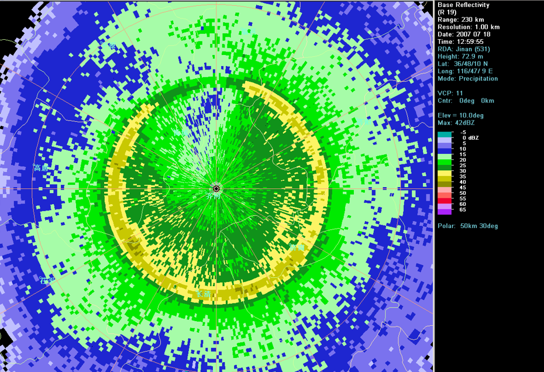
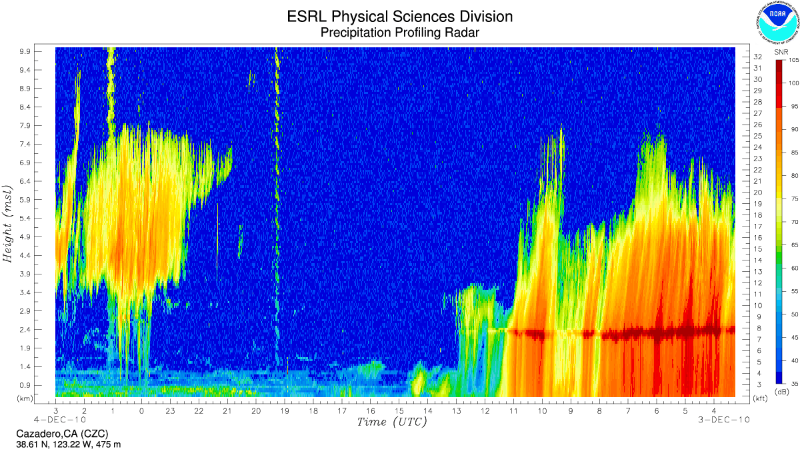

雷达回波的识别
==========================

零度层亮带
----------------------------
零度层亮带表现为层状云回波中，较高仰角PPT图上的圆环状强回波带或RHI扫描中的同一高度的强回波区。

其形成原因是高层冰晶下落过程中不断碰并聚合增长形成更大的雪花，增长使得反射率不断增加，直到接近融化层，
随着粒子穿过0℃层，雪花开始融化，使得其外层覆盖一层水膜（高反射率因子），这使得反射率明显增加，
随着雪花融化为液态水，使得粒子尺度减小（密度增加）并且大水滴有较大的下落末速度，减少了雷达取样体积内粒子
的数浓度，从而使得反射率减低，上述过程使得雷达回波上出现孤立的水平高反射率层，通常出现在0℃等温线以下100m左右。

下面动画展示了雪花下落到一个更暖的空气中，并且在暖层中部分融化聚合，从而使得雷达反射率增加，称为零度层亮带，随后雪花逐渐融化为雨滴，使得雷达反射率又减小。

.. raw:: html 

   <video controls src="_static/brightband.mp4"></video>

*动画来源：COMET*

	图：PPI图上的零度层亮带

	图：RHI图上的零度层亮带

三体散射回波
------------------------
A particular signature to note for the presence of hail is called the Three Body Scatter Spike, or TBSS. A TBSS generally appears as a 10-30 km long (6-20 mi), low reflectivity (< 20 dBZ), mid-level echo "spike" that extends outward along a radar beam from a high reflectivity core. This echo spike is an artifact, formed when portions of the radar pulses are scattered to the ground and then reflected off the ground and back into the hail core, where they are interpreted by the radar as being from a location farther away.

A TBSS is a nearly certain indicator of large hail, as it generally occurs when the target size is close to the same as the wavelength of the radar pulse. It typically only occurs within the strong convection found in supercell thunderstorms.

.. figure:: _static/KUEX_20080726_bref_1918Z.jpg
	:align: center
	:alt: 三体散射回波（TBSS）

	图：三体散射回波（TBSS，来源:COMET）

非气象回波
-------------------------------

生物回波
^^^^^^^^^^^^^^^^^^^^^^^^^^
